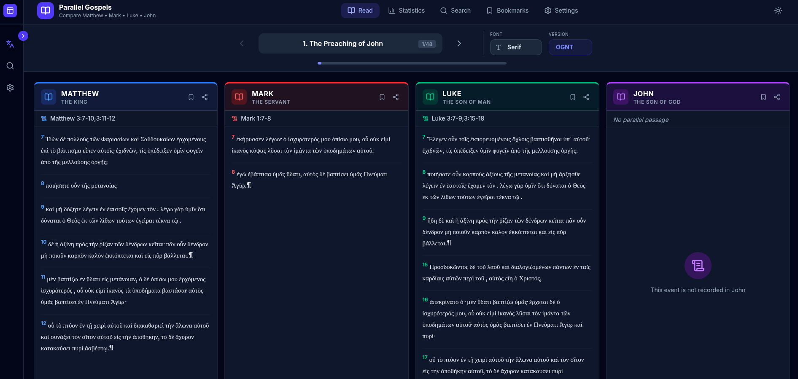
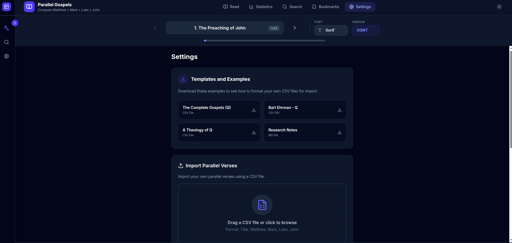
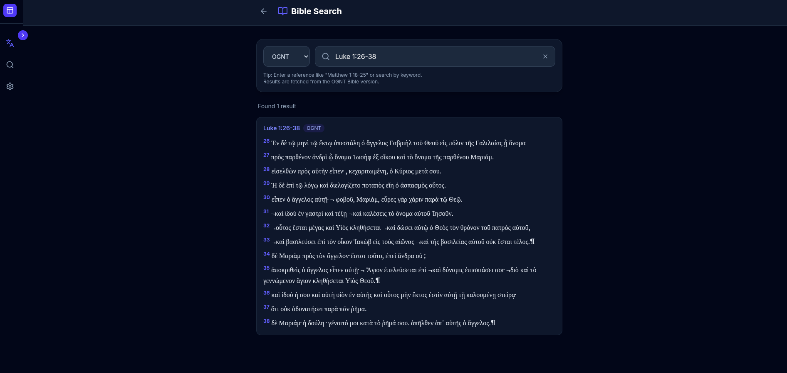
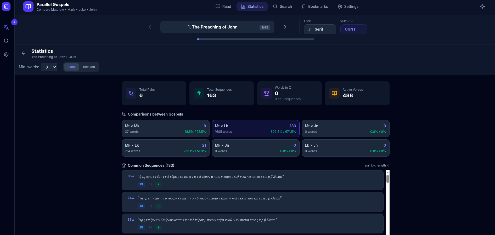

# Back

Optional

`git clone https://github.com/undergroundchurch/bible-api`

# Front

```bash
npm install
npm run dev
npm run build
```

The application includes a **"Parallel Reading"** mode that displays verses from multiple translations side-by-side for easy comparison.





